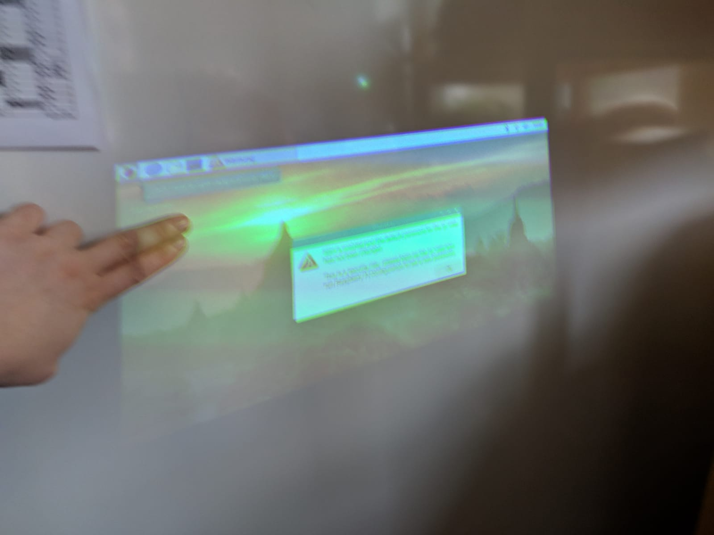
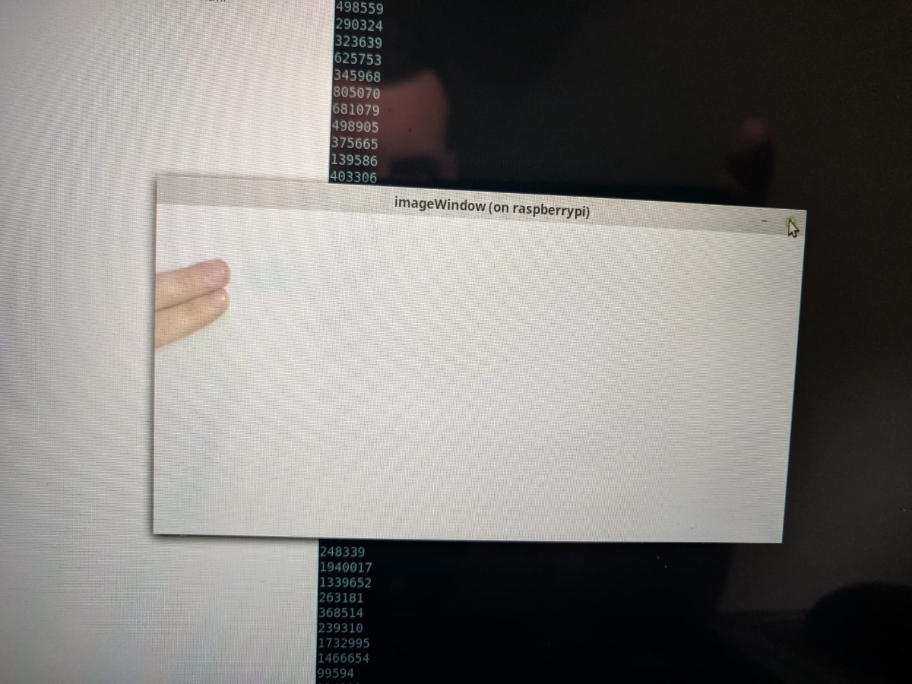

# Progini

A small projected interface implementation.

This project is using the Lantern Hardware (https://nordprojects.co/lantern/) with a typical raspbian setup as Android Things was discontinued.

Prerequisites:
* You will have to install opencv to use it.

At the moment there is only a small debug script that gives an insight on how to work with the setup.
You can connect to the Device via ssh -X to get a debug gui.

After starting the script the device is ready when you see numbers running down the terminal.
These numbers are an indicator on how much changed in the current picture.

If you move your hand into the projection to point to a certain place the hand will be filtered:

As a result you will see the clean hand as output.

This is used for further processing e.g. The position the hand is pointing to.
The detected position the hand is pointing to is shown by a green dot in the current implementation.
