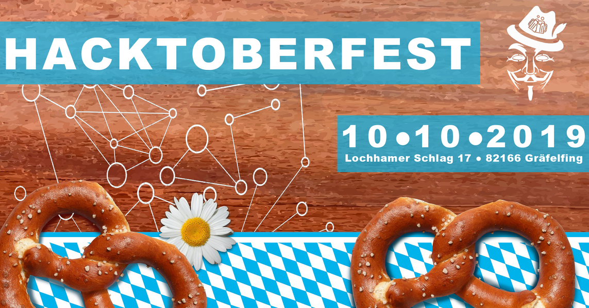
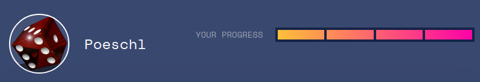

:css: style.css

.. title:: Hacktoberfest 2019 - Project Lantern

----

:data-x: 0
:data-y: 0
:data-scale: 1

Hacktoberfest 2019
==================

Project Lantern
---------------

Markus Pöschl & Michael Ziegler

----

:data-x: r2400
:data-y: 0

.. image:: images/PG_Logo_Web.png
   :height: 260px

Sponsor
-------

PIXEL Group GmbH

Simon Ashdown

----

.. image:: images/menu.png

Important things first
----------------------

* Schnitzel will arive at about 8:00 PM.
* Drinks and snacks in the kitchen.

We also have vegetarians covered. ;)

----

.. image:: images/hacktoberfest-official.svg
   :width: 700px

Hacktoberfest
-------------

* month-long celebration of open source software
	* support for open-source
* sponsored by DigitalOcean and DEV

----

:data-x: r0
:data-y: r1000

.. image:: images/hacktoberfest-official.svg
   :width: 700px

Rules
-----

* Register at https://hacktoberfest.digitalocean.com/
* Open 4 Pull Requests
	* Any repository on GitHub
	* Between 1 - 31 October
* (Wait 7 days)
* Profit (T-Shirt, Stickers and more)

Your Progress: https://hacktoberfest.digitalocean.com/profile

----

:data-x: r2400
:data-y: 0

Project Lantern
---------------

Codename: progini

----

:data-x: r0
:data-y: r1000

Finger-Tracking
---------------

* Python
* OpenCV

----

How does it work
----------------

1. Take a grayscale image
* Apply a threshold and erosion
* Detect Motion by comparing with previous image
* On Motion search for the bigest contour
* Take the point with the biggest distance to the sides
* Move the mouse pointer there

----

:data-x: r2400
:data-y: 0

Lantern-Blox
------------

* Maulwurf-like demo game
* Click the boxes when they appear
* Javascript + executed in fullscreen browser on lantern projector

----

Now is your turn
----------------

* Develop your own app / game
	* UI for Homeautomation
	* Memory
	* ...
* Improve the finger-detection
	* Alternative Mouse-Handling
	* ...

Sourcecode
----------

https://github.com/hacktoberfestmunich/progini

* Open a PR for your work

----

Testing ?
---------

* Lantern to test
	* Push as PR and notify us

* Raspberry Pi Simulation
	* No finger detection
	* Mouse simulates the finger input
	* More for performence testing 